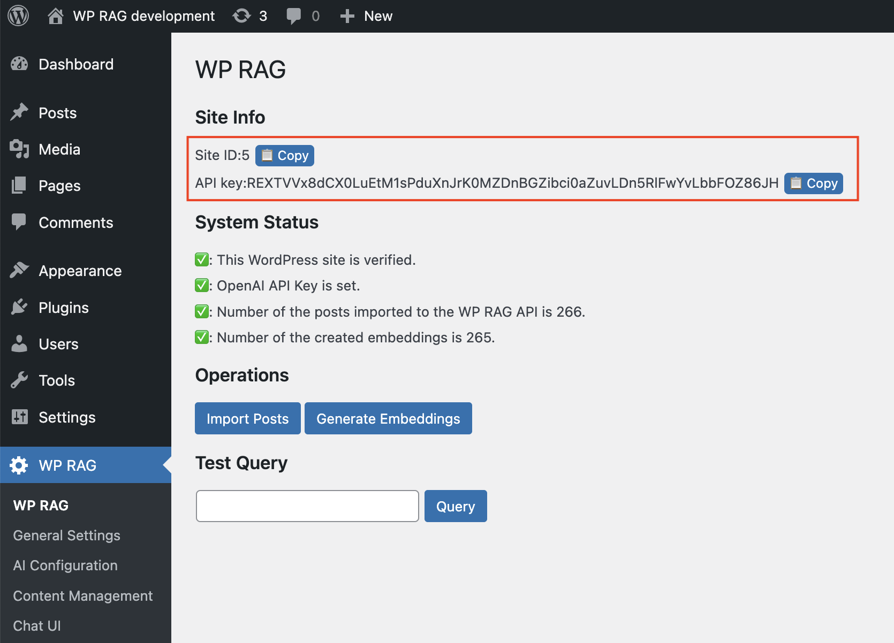
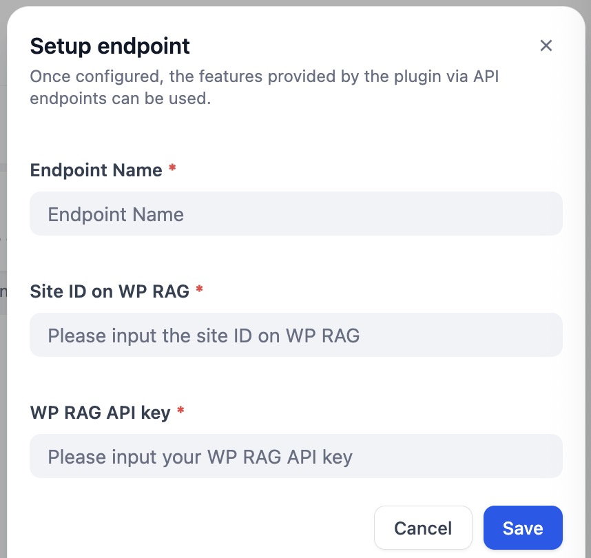
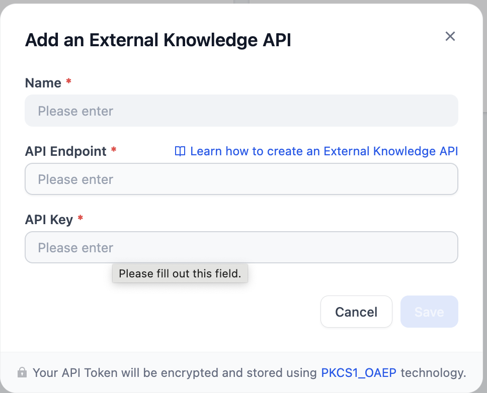
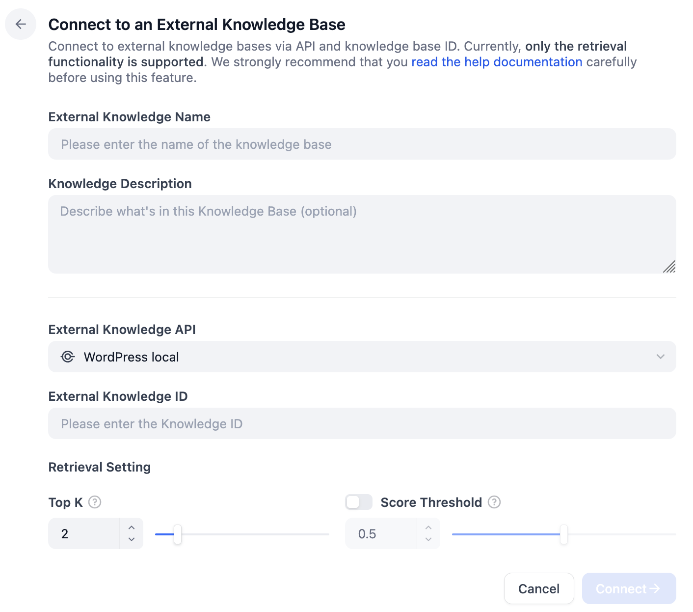

## dify-wp-rag

**Author:** mobalab
**Version:** 0.0.2
**Type:** extension

### Description

WP RAG is a WordPress plugin that brings the power of Retrieval-Augmented Generation (RAG) to your WordPress site
by leveraging your existing WordPress content.

This plugin, Dify WP RAG, allows you to use the vector database for WP RAG as a Dify's External Knowledge Base
so that you can create various types of AI solutions that leverage WordPress content in Dify.

In order for this plugin to work, you need to set up WP RAG first.
Please refer to the following page for the setup:  
[Installation and Setup Guide · mobalab/wp-rag Wiki](https://github.com/mobalab/wp-rag/wiki/Installation-and-Setup-Guide)

Once you set up WP RAG plugin in your WordPress, go to the main page of WP RAG,
and copy the site ID and API key for a later step:



Now, install this plugin from GitHub. Since this isn't a plugin verified by Dify's team,
you need to disable plugin verification by editing `.env` as follows:

```
FORCE_VERIFYING_SIGNATURE=false
```

After a successful installation of the plugin, go to the Plugin page, click on the plugin icon,
and add an endpoint on the following dialog:



Below are the values to enter:

* `Endpoint Name`: Arbitrary name
* `Site ID on WP RAG` and `WP RAG API key`: Use the values that you copied in a previous step.
  * If you're using an old version of WP RAG plugin, these values are invisible on plugin's pages. Instead,
    you can see them on the WordPress database by executing `select * from wp_options where option_name = 'wp_rag_auth_data'`

After adding an endpoint, copy the newly created endpoint URL, which looks like http://localhost/e/y64nt432xlp5p0g1/retrieval,
and remove the trailing `/retrieval`.

Then, go to Knowledge Base, "External Knowledge API", and "Add an External Knowledge API":



Put the following values to the fields:
* `Name`: Arbitrary name
* `API Endpoint`: the copied URL in the previous step. If you're running Dify locally, replace the host name with nginx. e.g. http://nginx/e/y64nt432xlp5p0g1
* `API Key`: This is not used, so put any string.

Once your external knowledge base is connected, go to "Connect to an External Knowledge Base":



Below are the values to enter:
* `External Knowledge Name`: Arbitrary name
* `Knowledge Description`: This is optional, so leave it blank.
* `External Knowledge API`: Choose the one that you created in the previous step.
* `External Knowledge ID`: This isn't used, so put any number here.
* `Retrieval Setting`: Change these values if necessary.

Now, you can do a retrieval test of your External Knowledge Base.